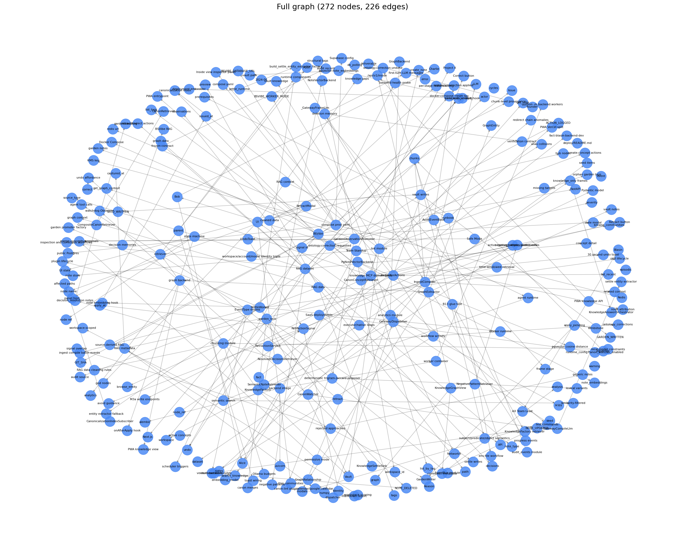
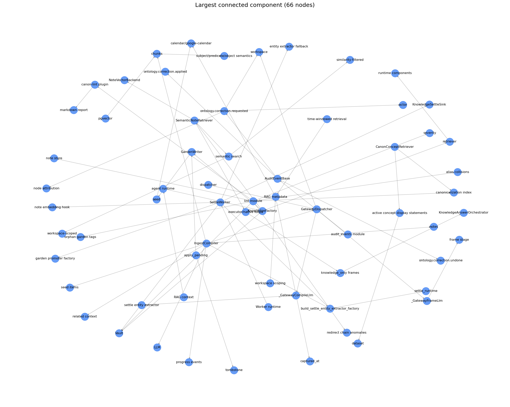

# 3주차 과제: RAG 외부 DB 구축 및 검증

2주차에서 정제한 BSVibe RAG 데이터셋(37 chunk)을 **외부 DB 2종**으로 적재하고
정량·정성 검증했습니다. 기술 스택은 우리 제품 **bsvibe-app** 의 실제 구현을 그대로 이식했습니다.

- **VectorRAG** = pgvector (bsvibe `backend/embedding/storage/pg.py`)
- **GraphRAG** = NetworkX 지식 그래프 + LLM triplet 추출 (bsvibe `backend/knowledge/graph`)

검증 재현: `notebooks/01_vector_rag.ipynb`, `notebooks/02_graph_rag.ipynb` (실행된 출력 포함).

---

## 1. VectorRAG (pgvector)

| 영역 | 구현 | bsvibe 원본 |
| --- | --- | --- |
| 임베딩 | `litellm.aembedding` (text-embedding-3-small, 1536d) | `embedding/provider.py` |
| 저장/검색 | SQLAlchemy async + asyncpg + pgvector raw `text()` SQL | `embedding/storage/pg.py` |
| 코사인 | `embedding <=> CAST(:qv AS vector)`, similarity = `1 - distance` | 동상 |

### ① 임베딩 차원 및 모델 일치 ✅

`vector(N)` 컬럼 차원, 행에 stamp된 `dimension`/`embedding_model`, 실제 쿼리 임베딩 길이가
모두 일치:

```
DB vector() 컬럼 차원      : 1536
행에 stamp된 (model, dim)  : [{'embedding_model': 'text-embedding-3-small', 'dimension': 1536}]
실제 쿼리 임베딩 길이       : 1536
→ vector(1536) == dimension 1536 == len(query_emb) 1536, model=text-embedding-3-small
```

모델명·차원을 **모든 행에 stamp** 하는 것은 bsvibe 의 stale-embedding 감지 패턴(모델 교체 시
재임베딩 트리거)을 이식한 것입니다.

### ② 적재 개수(Count) ✅

```
입력 chunk 수 : 37   (rag_chunks.jsonl)
DB 적재 count : 37   (SELECT count(*) FROM rag_chunks)
```

### ③ 유사도 검색 (golden 15문항)

2주차 검색 평가셋을 그대로 사용. 각 질문을 임베딩해 top-5 코사인 검색:

| 지표 | 값 |
| --- | --- |
| Hit@1 | **80.0%** |
| Hit@3 | **100.0%** |
| MRR | **0.878** |
| top-1 코사인 (min/mean/max) | 0.306 / 0.401 / 0.558 |

**정성 분석 — cross-lingual 갭**: golden 질문은 한국어, 문서는 영어입니다. 랭킹은 정확하지만
절대 코사인이 0.7 기준보다 낮게 나오는 경향이 있어, 동일 질문을 영어로도 던져 비교:

```
KO (원본)        top1_sim=0.456  src=bsvibe-src-002
EN (동일 의미)     top1_sim=0.716  src=bsvibe-src-002   ← 같은 정답 문서
```

→ '코사인 0.7 이상' 절대 기준은 monolingual(EN↔EN) 가정입니다. KO↔EN 에서는 동일 정답이라도
절대값이 ~0.26 깎이므로, 검색 품질 판단은 **랭킹 기반 지표(Hit@k/MRR)** 가 더 신뢰할 신호입니다.
Hit@3 = 100% 로 모든 질문이 top-3 안에 정답을 회수합니다.

### ④ sparse baseline (BM25) 비교 — dense 도입 정당화

"Hit@3 = 100%" 라는 절대값만 보면 dense embedding 이 얼마나 기여했는지 가늠하기 어려워서,
동일 데이터셋·동일 평가셋에 **순수 stdlib BM25** (k1=1.5, b=0.75, doc = `text + title + tags`)
를 sparse baseline 으로 돌렸습니다. 재현:

```bash
python assignments/week3-rag-db/scripts/bm25_baseline.py
```

| 지표 | sparse (BM25) | dense (text-embedding-3-small) | gain |
| --- | --- | --- | --- |
| Hit@1 | 60.0% | **80.0%** | **+20.0%p** |
| Hit@3 | 73.3% | **100.0%** | **+26.7%p** |
| MRR | 0.692 | **0.878** | **+0.186** |

해석:
1. **BM25 도 만만치 않다** — 코드/식별자가 풍부한 데이터셋이라 `pgvector`, `settle`,
   `frontmatter`, `canonical` 같은 영문 키워드가 한국어 질문에 그대로 섞여 lexical
   매칭이 잘 됩니다 (sparse 만으로도 Hit@3 73%).
2. **dense 가 메우는 것** — sparse 가 못 잡은 케이스는 한영 혼합 토큰(`retract하면`)
   처럼 형태소 분리가 필요한 질문이나, 동일 개념의 어휘 다양성 (e.g. "negative pattern"
   ↔ "거절한 접근"). dense embedding 이 의미 유사도로 메워 Hit@3 100% 달성.
3. **다음 단계 비교 기준** — 향후 hybrid (sparse + dense) 나 rerank 도입 시 이 두 지표가
   비교 기준이 됩니다.

### ⑤ 실제 top-K 살펴보기 (대표 3문항)

aggregate 만 보면 "어떤 방식으로 맞히고 틀리는지" 가 안 보여, 노트북 §⑤ 에 대표 3문항의 top-5 를
sparse / dense 둘 다 실측한 출력으로 embed 했습니다. 핵심 케이스 (`q-010`):

```
[q-010] 파운더가 잘못된 노드를 retract하면 어떤 흐름으로 처리되나요?
  expected: bsvibe-src-016, bsvibe-src-022, bsvibe-src-024

  sparse(BM25) top-5:
    1. bsvibe-src-001   score=0.00     ← 모두 0.00. 'retract하면' 같은 한영
    2. bsvibe-src-002   score=0.00        혼합 토큰이 tokenizer 에서 분리되지
    3. bsvibe-src-003   score=0.00        않아 매칭할 어휘가 없음 → 원리적으로
    4. bsvibe-src-004   score=0.00        풀 수 없는 케이스
    5. bsvibe-src-005   score=0.00

  dense(pgvector) top-5:
    1. bsvibe-src-027   sim=0.310      RetractModal (관련 surface)
    2. bsvibe-src-016   sim=0.297  ✓   RetractionService (M3a 서비스)
    3. bsvibe-src-022   sim=0.290  ✓   RetractionSignal (도메인 모델)
    4. bsvibe-src-029   sim=0.251      UndoToast (관련 UI)
    5. bsvibe-src-005   sim=0.230      Negative patterns
```

→ sparse 가 0/3 인 케이스를 dense 가 2/3 회수. **lexical 한계 + cross-lingual + 어휘 다양성을
한 번에 보여주는 결정적 사례**입니다. `q-001`, `q-007` 도 동일 포맷으로 노트북에 출력 — 두
경우는 sparse 도 정답을 잡지만 dense 의 sim 마진이 명확히 큽니다 (q-001: 0.500 vs 차순위 0.316).

---

## 2. GraphRAG (NetworkX + LLM triplet)

| 영역 | 구현 | bsvibe 원본 |
| --- | --- | --- |
| triplet 추출 | `litellm` JSON 계약 (gpt-4o-mini) | `ingest/llm_extractor.py` |
| 개체명 정제 | `normalize_name` + alias | `graph_models.py`, `graph/vault_backend.py` |
| 그래프 | NetworkX `MultiDiGraph` | `graph/vault_backend.py` |

### ① triplet 스키마 및 무결성 ✅

`parse_triplets` 가 `(주어, 관계, 목적어)` 중 None/빈 문자열이 있으면 그래프에 넣지 않고
거부 카운트로 남깁니다. 깨진 JSON 도 크래시 없이 빈 결과 처리.

```
# 의도적으로 망가진 입력 시연
통과한 entity      : [('KnowledgeFactory', 'component')]
통과한 relationship : [('KnowledgeFactory', 'constructs', 'Vault')]
거부된 entity 수    : 3   (빈 이름 / None / 빈 타입)
거부된 relationship : 2   (빈 target / None source)
깨진 JSON          : parse_ok=False, 빈 결과 (크래시 X)

# 실제 37 chunk 빌드
거부된 entity 0 · 거부된 relationship 0 · JSON 파싱 실패 0 · 그래프 내 빈 이름 노드 0
```

### ② 개체명 중복 제거(Entity Resolution) ✅

동일 개체의 표기 흔들림을 한 노드로 통합 (이순신/충무공의 BSVibe 판):

```
입력 표기 5종: KnowledgeFactory, knowledge factory, knowledge-factory,
              the knowledge factory, KNOWLEDGEFACTORY
→ 노드 수: 1   (통합)
→ 누적 entity_types: ['component', 'concept', 'module']
```

`normalize_name`(대소문자·공백) + alias(표기 흔들림)로 통합합니다. 실제 빌드 정제 퍼널:

```
entity mention 총합     : 290
distinct 표기(raw)      : 267
  → normalize_name 후   : 266
  → alias 환원 후        : 266   (= entity 노드 수)
```

> BSVibe 코드 기반 텍스트라 LLM 이 비교적 일관된 표기를 내, 실데이터의 정제량은 작습니다.
> 위 5종 표기 시연이 메커니즘을 직접 증명합니다.

**설계 결정**: bsvibe `vault_backend` 는 `(name, entity_type)` 로 노드를 키잉합니다(ontology 가
타입을 제약하므로 안전). 그러나 우리 환경은 LLM 이 같은 개체에 chunk 마다 다른 free-form
`entity_type` 을 부여해 노드가 파편화됐습니다. 그래서 **이름을 개체 정체성으로** 삼고 관측된
타입들은 노드 속성(`entity_types`)에 누적 보존하도록 조정했습니다.

### ③ 지식 그래프 토폴로지 ✅

```
총 노드 수            : 272
총 엣지 수            : 226
weakly connected comp : 49   (최대 컴포넌트 66 노드 = 24.3%)
단일 노드(고립) 수    : 11
허브 노드(degree)     : RAG dataset(12), compose.prod.yaml(10),
                       knowledge MCP domain tools(9), IngestCompiler(8), ...
관계 타입 분포        : related_to 50, produces 28, uses 22, exposes 17, depends_on 17, ...
```

시각화:  — 전체 그래프(코어+파편).
 — 최대 연결 컴포넌트(라벨 가독).

하나의 큰 연결 코어 + 다수의 작은 파편이 공존합니다. 이는 **chunk 단위 독립 추출**(전역
entity-resolution 패스 부재)의 자연스러운 결과입니다. 코어 시각화로 핵심 컴포넌트 내부의
연결 고리(KnowledgeFactory–Vault–GardenWriter–SettleWorker 등)가 이어짐을 직관 확인했습니다.

---

## 3. 재현 방법

```bash
source .venv/bin/activate
pip install -r assignments/week3-rag-db/requirements.txt

# pgvector 컨테이너
docker compose -f assignments/week3-rag-db/docker-compose.yml up -d

# 빌드
python assignments/week3-rag-db/scripts/build_vector_db.py   # VectorRAG 적재 + 검증
python assignments/week3-rag-db/scripts/build_graph_db.py    # GraphRAG 추출 + 시각화

# 검증 노트북 (실행된 출력 포함)
#   notebooks/01_vector_rag.ipynb, notebooks/02_graph_rag.ipynb

# 테스트
cd assignments/week3-rag-db && python -m pytest tests/ -q   # 28 passed
```

> 수치(특히 그래프 노드/엣지 수)는 LLM 추출 비결정성으로 실행마다 ±소폭 달라집니다.
> 보고서 값은 커밋된 `data/knowledge_graph.json` / `data/graph_report.json` 기준입니다.
