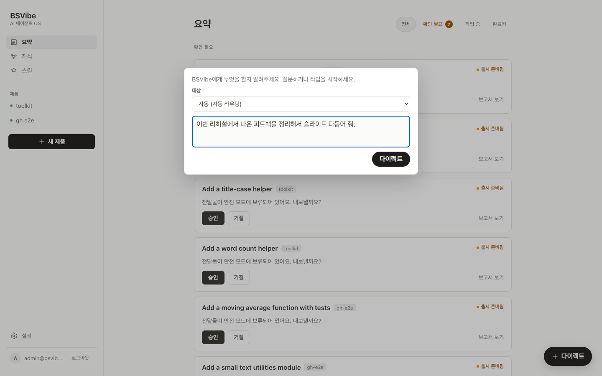
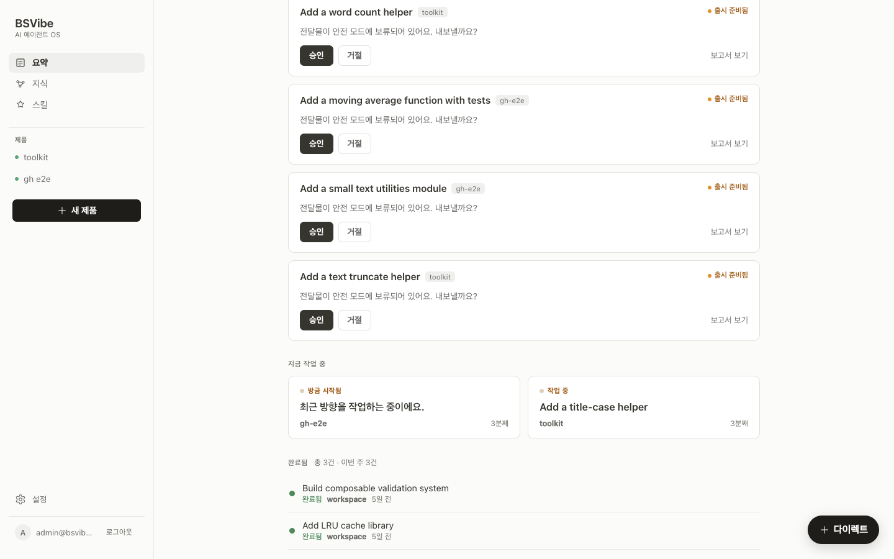
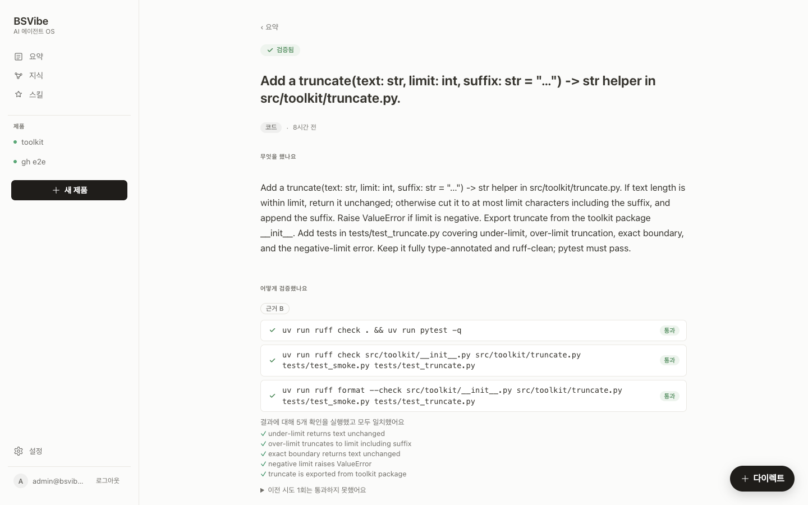
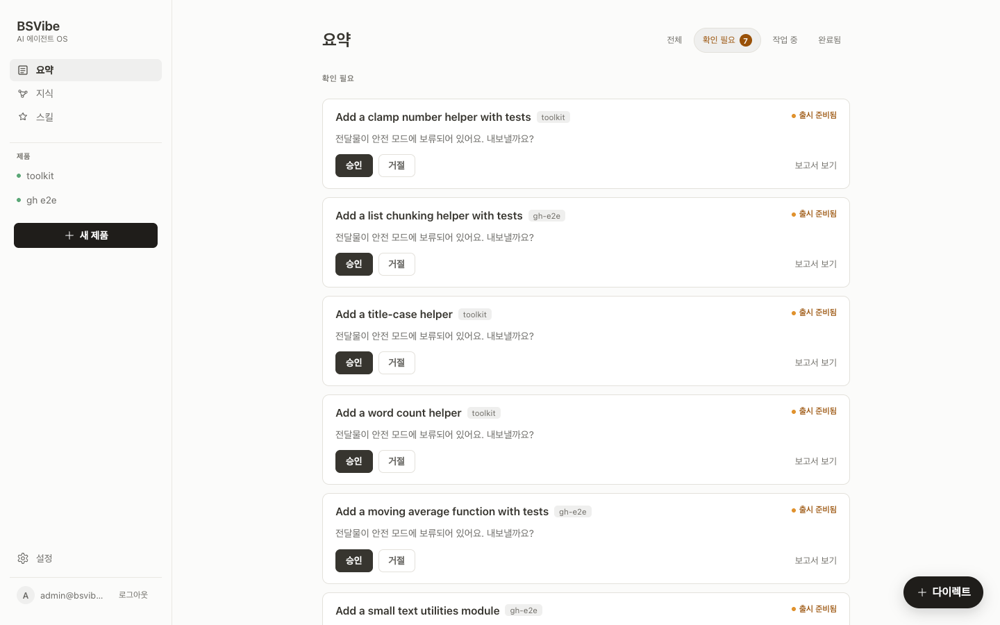
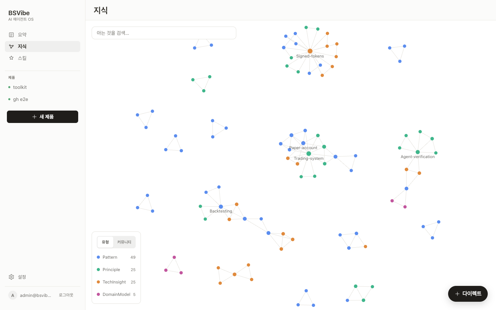
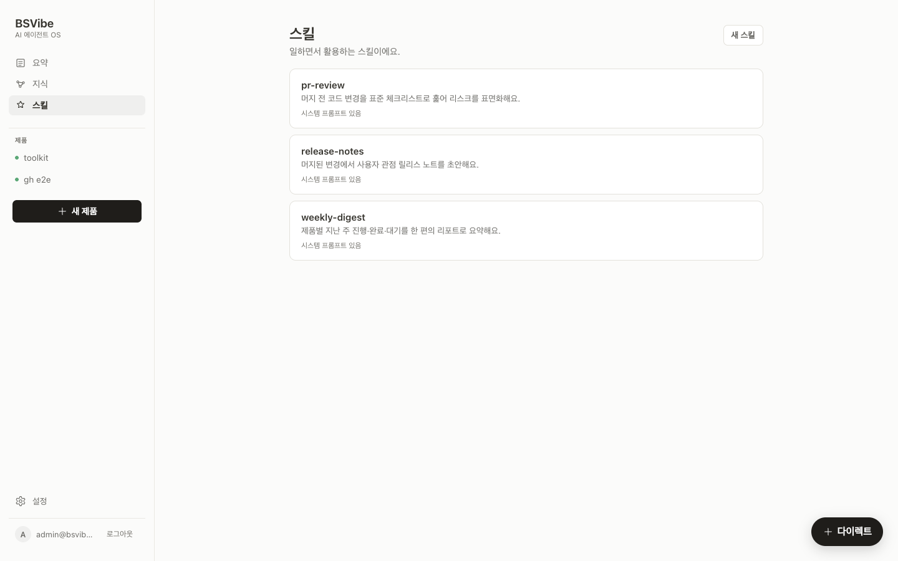

<!-- _class: cover -->

AI가 만들고, 검증까지

# BSVibe

믿음이 아닌, 증명.

메타코드 부트캠프 · 최종 발표 김동휘 · qazasa123@gmail.com

---

## 한 사람이, 여러 제품을

여러 제품을 동시에 굴리면 작업 자체보다 **머릿속을 정리하는 일** 이 더 무거워집니다.

- 같은 결정을 두 번, 세 번 다시 내림 — 이전에 어떻게 정했는지 흩어져 있음
- AI 가 만든 결과를 **사람이 처음부터 다시 확인** 해야 함 — "끝났다" 를 못 믿음
- 잡일이 진짜 일을 가림 — 메일 분류, 이슈 정리, 진행 현황 모으기

> **"AI 가 일을 더 시키긴 하는데, 결과를 믿을 수 있어야 시간이 진짜 줄어든다."**

---

## BSVibe 가 답하는 한 줄

**한 줄 던지면 AI 가 일하고, 스스로 확인하고, 사람이 읽을 수 있는 근거와 함께 돌려줍니다. 한 번 바로잡으면 같은 실수는 두 번 없습니다.**

검증된 결과
같은 실수는 한 번만
혼자서, 여러 제품

app.bsvibe.dev

---

## 어떻게 작동하나요

| 단계 | 무엇이 일어나나 |
|---|---|
| **① 던지세요** | **다이렉트** 버튼으로 한 줄. 메일·GitHub 이슈가 들어오면 자리에 없어도 시작 |
| **② AI 가 일합니다** | 계획·실행·확인을 스스로 반복. 갈림길에선 물어보고, 답을 받으면 그 자리에서 이어감 |
| **③ 근거를 냅니다** | "끝났다" 를 그냥 믿지 않음. 어떤 방법으로 어떻게 확인했는지 결과까지 함께 |
| **④ 기억합니다** | 한 번 바로잡은 것이 쌓임. 다음부터 같은 실수는 알아서 피함 |

① 던지세요 — 다이렉트 한 줄

> 감독할 일이 시간이 지날수록 **줄어듭니다.**

---

## 요약 — 작업 한눈에

운영 콘솔이 아니라, **사람이 말하듯 설명하는 현황판**. 세 줄로 정리:

- **지금 작업 중** — 돌고 있는 일
- **결정 대기** — 갈림길에서 올라온 안건, 그리고 밖으로 내보내기 전 승인 대기
- **지난 작업** — 끝난 일과 전달물이 시간 순서대로

> 처리 안 된 것이 모두 한 화면에 모입니다.

요약 (Brief) — 세 줄 현황판

---

## 전달물 리포트 — 유리상자처럼 투명한 결과

한 장 짜리 **전달물 리포트** 로 도착 — 다섯 블록.

| 블록 | 의미 |
|---|---|
| 헤더 | 제목 · 유형 · 판정 · 날짜 |
| 요청 | 내가 던졌던 그 한 줄 |
| 만든 것 | 파일 내용 인라인 |
| 확인 | 검사 계획 + 실행 결과 |
| 변경 코드 | diff 링크 |

<b>확인 없이 "통과" 못 박음</b> — "이 작업은 이렇게 확인하겠다" 가 데이터로 강제.

전달물 리포트 (Delivery Report)

---

## 결정 — 필요할 때만 부릅니다

취향·범위·방향 같은 **혼자 정하면 안 되는 갈림길** 만 올라옵니다. AI 가 단순히 묻기만 하는 게 아니라 **답안 후보까지 같이 제안**.

- 후보 답안 제시 — "이렇게 하면 어떨까요?"
- 후보 중 선택 또는 **직접 입력**
- 답한 순간 그 자리에서 작업 이어짐
- 그 선택은 **결정 답안** 으로 기억 → 다음 케이스 자동 재사용

결정 대기 — 승인·거절·수정 후 통과

> _"매번 같은 걸 다시 묻지 않는다"_ — 결정 화면의 기술적 실체.

---

## 안전 모드 — 밖으로 나가는 건, 승인 후에

푸시 · 머지 · 메일 발송 · 외부 호출 같은 **되돌리기 어려운 작업** 은 사용자 승인 전엔 밖으로 나가지 않습니다.

- 작업 공간마다 정책으로 분류 — 안전한 것은 자동, 위험한 것은 보류
- 보류된 작업은 요약 화면의 **결정 대기** 줄에 모임
- 통과 / 거절 / 수정 후 통과 세 선택지

> 사용자가 진짜 신경 써야 할 결정에만 시간을 쓰도록 — 사고를 막는 안전망.

---

## 쓰던 LLM 도구를 그대로

bsvibe 가 LLM 을 강요하지 않습니다. **사용자가 이미 깔아 쓰는 도구** 를 그대로 결합:

claude code
codex
opencode

- 한 줄 명령으로 내 컴퓨터에 작은 도우미(worker) 를 띄우면 bsvibe 와 연결
- 받은 작업을 내 컴퓨터의 도구로 실행해 결과를 stream 으로 돌려보냄 — 시간 초과·횟수 제한 다 처리
- 내가 이미 쓰던 구독·세팅이 그대로 살아있음 — **bsvibe 가 LLM 비용을 따로 받지 않음**

> bsvibe = 작업 배분 + 결과 확인 + 기억. **LLM 선택은 사용자의 몫.**

---

## 안에서 어떻게 굴러가나 — 소프트웨어 구조

클라이언트

<b>PWA (Next.js)</b>요약 · 결정 · 지식 · 스킬 · 리포트
모바일 우선 · 다이렉트 입력

↓ HTTPS ↑

백엔드 파이프라인

<b>인테이크</b>
/messages 수신

<b>프레이밍</b>
지식 답변 vs 실행 분기 + 도구 라우팅

<b>실행</b>
계획·행동·확인 loop

<b>검증</b>
약속 실행 → 관측 판정

<b>전달</b>
리포트 · 지식 반영

↓  ↓  ↓

사용자 등록 자원

<b>답변 LLM</b>API 키형 (openai · anthropic · ollama) · CLI 워커 (claude code · codex · opencode)

<b>외부 커넥터</b>GitHub · Slack · Discord · Notion · Email — 폴링/웹훅으로 인테이크 유입

저장소

<b>PostgreSQL</b>
사실 · 상태 · 감사 로그

<b>pgvector</b>
임베딩 (의미 검색)

<b>NetworkX</b>
지식 그래프

실행 엔진 · 도구 라우팅 · 안전 가드레일 · 기억 — 위 5 단계 파이프라인 안에 다 담겨 있음.

---

## 남는 것 — 지식 · 스킬

작업이 끝나도 두 갈래 자산이 남습니다.

- **지식** — 사실. 결정 답안 · 관찰 메모 · 거절 패턴. 반복되면 **표준 개념** 으로 승격. 다음 요청이 자동으로 인용.
- **스킬** — 방법. 반복 절차가 재사용 자산으로 승격. 다음엔 처음부터 짜지 않아도 됨.

검색은 **세 갈래 결합** (의미 · 키워드 · 그래프 이웃). 잘못 학습한 노드는 한 클릭 **철회** — 30 초 안에 **되돌리기**.

지식 — 개념·결정·거절 패턴 그래프

스킬 — 재사용 가능한 절차

---

## 어디서든, 무엇과도

웹 기반 — **설치 없이 브라우저** 만 있으면 데스크톱·모바일 같은 경험.

쓰던 도구를 그대로 연결. 예를 들면:

GitHub
Slack
Discord
Notion
Email

대부분 한 번 로그인 — 그 다음은 작업 공간이 알아서 폴링·웹훅 처리.

---

## 기술 스택 (간단)

- **웹 스택**: Next.js 14 PWA (Vercel) + FastAPI + PostgreSQL
- **저장 · 검색**: pgvector · NetworkX · 세 갈래 랭킹 (의미 + 키워드 + 그래프)
- **답변 생성**: 추상화된 인터페이스 — 사용자가 선택
  - API 키 등록형 — openai · anthropic · ollama (LiteLLM)
  - 내 컴퓨터의 CLI 워커 — claude code · codex · opencode
- **임베딩**: 마찬가지로 사용자가 등록
- **로그인**: Supabase

---

## 라이브 데모

**app.bsvibe.dev**

데모 흐름

1. **요약** — 작업 중 / 결정 대기 / 지난 작업 한 화면
2. **다이렉트** — 입력창에 한 줄
3. **전달물 리포트** — 요청 → 만든 것 → 어떻게 확인했나 → 변경 코드
4. **지식** — 학습된 지식 그래프 시각화
5. **철회** — 잘못 학습한 노드 한 클릭 → 30 초 되돌리기 토스트

---

# 감사합니다

Q&A

